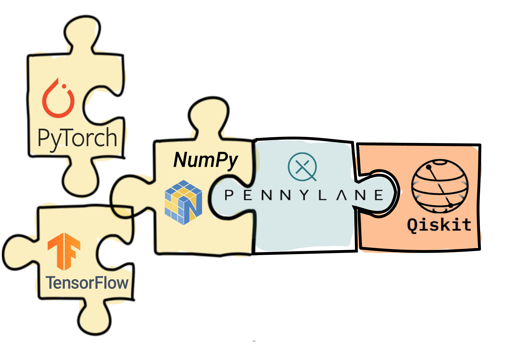

PennyLane Qiskit Plugin
#######################

.. image:: https://img.shields.io/travis/com/XanaduAI/pennylane-qiskit/master.svg?style=popout-square
    :alt: Travis
    :target: https://travis-ci.com/XanaduAI/pennylane-qiskit

.. image:: https://img.shields.io/codecov/c/github/XanaduAI/pennylane-qiskit/master.svg?style=popout-square
    :alt: Codecov coverage
    :target: https://codecov.io/gh/XanaduAI/pennylane-qiskit

.. image:: https://img.shields.io/codacy/grade/f4132f03ce224f82bd3e8ba436b52af3.svg?style=popout-square
    :alt: Codacy grade
    :target: https://www.codacy.com/app/XanaduAI/pennylane-qiskit

.. image:: https://img.shields.io/readthedocs/pennylane-qiskit.svg?style=popout-square
    :alt: Read the Docs
    :target: https://pennylane-qiskit.readthedocs.io

.. image:: https://img.shields.io/pypi/v/PennyLane-qiskit.svg?style=popout-square
    :alt: PyPI
    :target: https://pypi.org/project/PennyLane-qiskit

.. image:: https://img.shields.io/pypi/pyversions/PennyLane-qiskit.svg?style=popout-square
    :alt: PyPI - Python Version
    :target: https://pypi.org/project/PennyLane-qiskit

.. header-start-inclusion-marker-do-not-remove

The PennyLane-Qiskit plugin integrates the Qiskit quantum computing framework with PennyLane's
quantum machine learning capabilities.

|

`PennyLane <https://pennylane.readthedocs.io>`_ is a cross-platform Python library for quantum machine
learning, automatic differentiation, and optimization of hybrid quantum-classical computations.

`Qiskit <https://qiskit.org/documentation/>`_ is an open-source framework for quantum computing.

Features
========

* Provides three devices to be used with PennyLane: ``qiskit.basicaer``, ``qiskit.aer`` and ``qiskit.ibmq``.
  These devices provide access to the various backends, including the IBM hardware accessible through the cloud.

* Supports a wide range of PennyLane operations and expectation values across the providers.

* Combine Qiskit's high performance simulator and hardware backend support with PennyLane's automatic
  differentiation and optimization.

.. header-end-inclusion-marker-do-not-remove
.. installation-start-inclusion-marker-do-not-remove

Installation
============

This plugin requires Python version 3.5 and above, as well as PennyLane and Qiskit.
Installation of this plugin, as well as all dependencies, can be done using ``pip``:

.. code-block:: bash

    pip install pennylane-qiskit

To test that the PennyLane Qiskit plugin is working correctly you can run

.. code-block:: bash

    $ make test

in the source folder. Tests restricted to a specific provider can be run by executing
``make test-basicaer``, ``make test-aer``, and ``make test-ibmq``.

.. note::

    Tests on the `IBMQ device <https://pennylane-qiskit.readthedocs.io/en/latest/code/ibmq.html>`_ can
    only be run if a ``ibmqx_token`` for the
    `IBM Q experience <https://quantum-computing.ibm.com/>`_ is
    configured in the `PennyLane configuration file
    <https://pennylane.readthedocs.io/en/latest/introduction/configuration.html>`_.

    If this is the case, running ``make test`` also executes tests on the ``ibmq`` device.
    By default tests on the ``ibmq`` device run with ``ibmq_qasm_simulator`` backend
    and those done by the ``basicaer`` and ``aer`` device are run with the ``qasm_simulator``
    backend. At the time of writing this means that the test are "free".
    Please verify that this is also the case for your account.

.. installation-end-inclusion-marker-do-not-remove

Please refer to the `plugin documentation <https://pennylane-qiskit.readthedocs.io/>`_ as
well as to the `PennyLane documentation <https://pennylane.readthedocs.io/>`_ for further reference.

.. howtocite-start-inclusion-marker-do-not-remove

How to cite
===========

If you are doing research using PennyLane, please cite `our whitepaper <https://arxiv.org/abs/1811.04968>`_:

  Ville Bergholm, Josh Izaac, Maria Schuld, Christian Gogolin, Carsten Blank, Keri McKiernan and Nathan Killoran.
  PennyLane. *arXiv*, 2018. arXiv:1811.04968

.. howtocite-end-inclusion-marker-do-not-remove

Contributing
============

We welcome contributions - simply fork the repository of this plugin, and then make a
`pull request <https://help.github.com/articles/about-pull-requests/>`_ containing your contribution.
All contributers to this plugin will be listed as authors on the releases.

We also encourage bug reports, suggestions for new features and enhancements, and even links to cool projects
or applications built on PennyLane.

Authors
=======

Shahnawaz Ahmed, Carsten Blank, Sebastian Boerakker, Christian Gogolin, Josh Izaac.

.. support-start-inclusion-marker-do-not-remove

Support
=======

- **Source Code:** https://github.com/XanaduAI/pennylane-qiskit
- **Issue Tracker:** https://github.com/XanaduAI/pennylane-qiskit/issues
- **PennyLane Forum:** https://discuss.pennylane.ai

If you are having issues, please let us know by posting the issue on our Github issue tracker, or
by asking a question in the forum.

.. support-end-inclusion-marker-do-not-remove
.. license-start-inclusion-marker-do-not-remove

License
=======

The PennyLane qiskit plugin is **free** and **open source**, released under
the `Apache License, Version 2.0 <https://www.apache.org/licenses/LICENSE-2.0>`_.

.. license-end-inclusion-marker-do-not-remove
